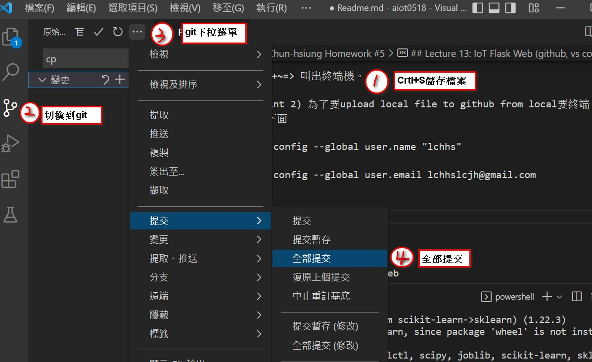
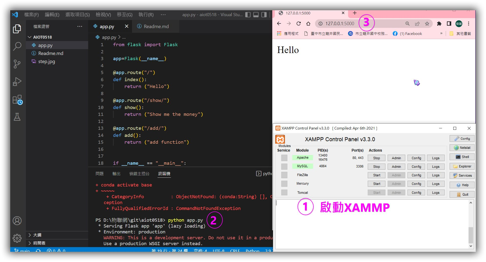
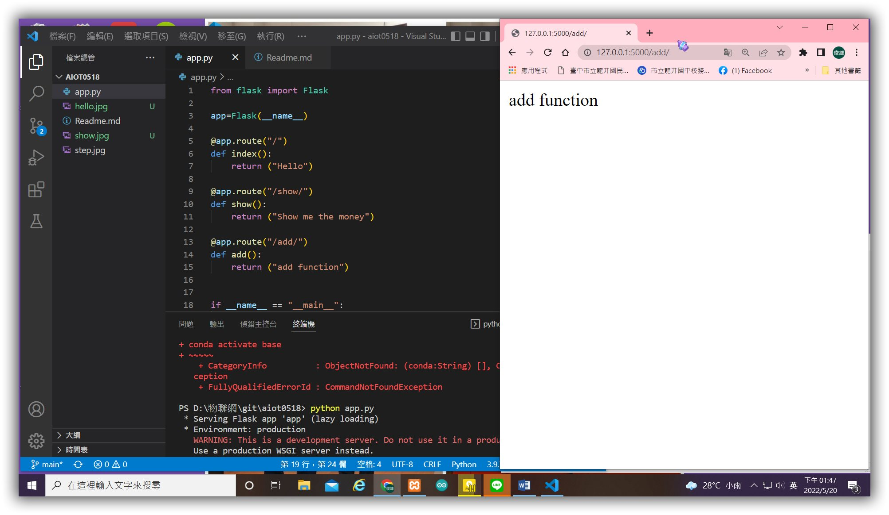
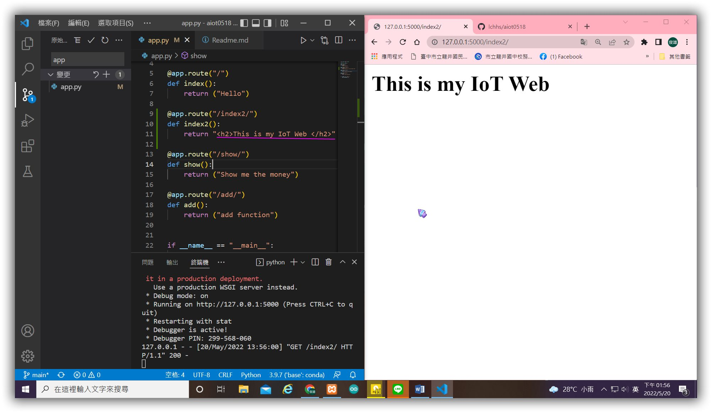
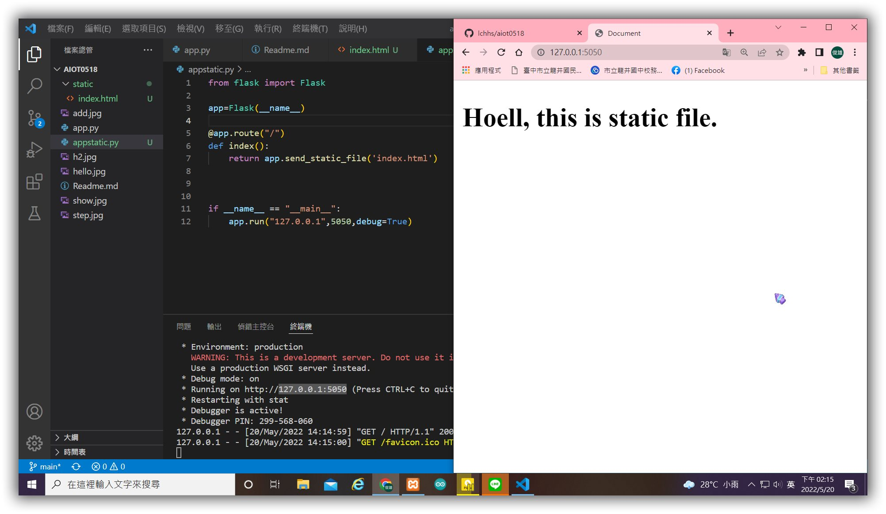

# Chun-hsiung Homework #5

## Lecture 13: IoT Flask Web (github, vs code)
### Development Environment Setup
1.Please install vs code, register github, install git for windows

2.(check-point 1)github create a new repository (aiot0518)

3.go to vs code clone this repository

4.vs code 安裝 python extension

5.pip install flask, pandas, sklearn

*快捷鍵 ctrl+shift+p ===> package manager 叫出 (git clone....)

*快捷鍵 ctrl+~=> 叫出終端機。

6.(check-point 2) 為了要upload local file to github from local要終端機 C:> 設定下面

    C:> git config --global user.name "lchhs"

    C:> git config --global user.email lchhslcjh@gmail.com

增加圖片

Flask Web Development

7.(check-point 3) simple flask web
    
    return 'hello world'
    retun "Hello World big font"
    

    return return app.send_static_file('index.html') ==> remeber to create static/index.html

